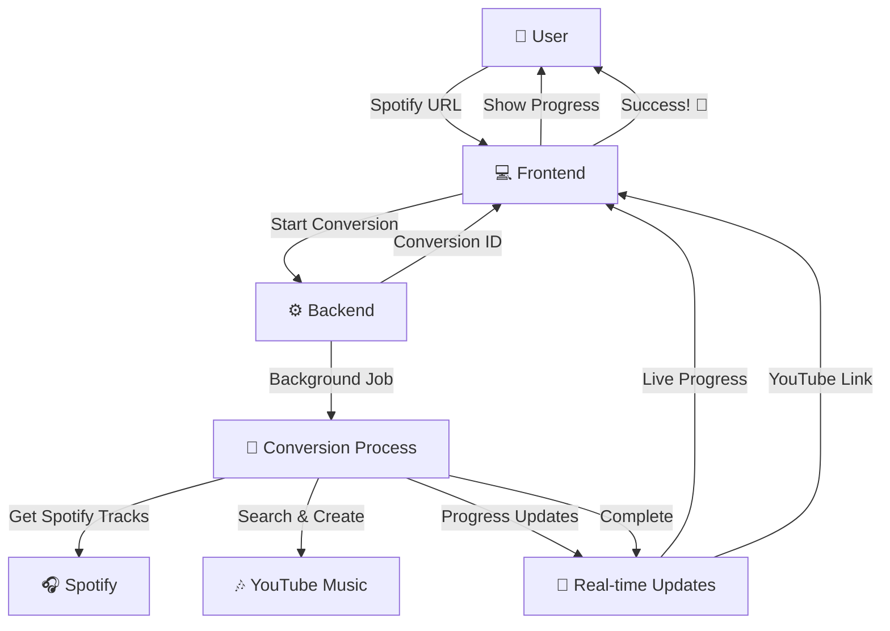

# 🎵 Playlist Converter

Convert your Spotify playlists to YouTube Music effortlessly! A modern full-stack application with real-time progress tracking and smart song matching.

## ✨ Features

- 🎯 **One-Click Conversion** - Just paste a Spotify playlist URL
- 🧠 **Smart Matching** - Advanced fuzzy matching to find the best YouTube Music equivalents
- ⚡ **Real-time Progress** - Live updates during conversion with detailed feedback
- 📊 **Detailed Results** - See exactly which tracks were converted and which failed
- 🔄 **Background Processing** - Long-running conversions with cancellation support
- 🌐 **Modern UI** - Clean, responsive interface built with React and Ant Design

## 🏗️ Architecture



## 🚀 Tech Stack

| Component         | Technology                                           |
| ----------------- | ---------------------------------------------------- |
| **Frontend**      | React 18, TypeScript, Vite, Tailwind CSS, Ant Design |
| **Backend**       | Express.js, TypeScript, Firebase Admin               |
| **Microservice**  | Python 3.8+, Flask, ytmusicapi                       |
| **Database**      | Firebase Firestore                                   |
| **External APIs** | Spotify Web API, YouTube Music API                   |
| **Deployment**    | Google Cloud Run, Firebase Hosting                   |

## 📋 Prerequisites

- **Node.js** 22+ and npm 10+
- **Python** 3.8+
- **Spotify API** credentials (Client ID & Secret)
- **Google Cloud** account with Firebase project
- **YouTube Music** account (free account works fine!)

## ⚡ Quick Start

### 1. Clone and Setup Environment

```bash
git clone <your-repo-url>
cd playlist-converter
cp backend/.env.example backend/.env
cp frontend/.env.example frontend/.env
cp ytmusic-microservice/.env.example ytmusic-microservice/.env
```

### 2. Configure Environment Variables

**Backend (`backend/.env`):**

```env
SPOTIFY_CLIENT_ID=your_spotify_client_id
SPOTIFY_CLIENT_SECRET=your_spotify_client_secret
GOOGLE_APPLICATION_CREDENTIALS=your_base64_encoded_service_account
```

**Frontend (`frontend/.env`):**

```env
VITE_FIREBASE_API_KEY=your_firebase_api_key
VITE_FIREBASE_PROJECT_ID=your_project_id
# ... other Firebase config
```

### 3. Start All Services

```bash
# Terminal 1: Backend
cd backend && npm install && npm run dev

# Terminal 2: Python Microservice
cd ytmusic-microservice && pip install -r requirements.txt && python app.py

# Terminal 3: Frontend
cd frontend && npm install && npm run dev
```

### 4. Open the App! 🎉

Visit **http://localhost:5173** and start converting playlists!

## 🎯 How to Use

1. **Get a Spotify playlist URL** (must be public)

   ```
   https://open.spotify.com/playlist/37i9dQZF1DX0XUsuxWHRQd
   ```

2. **Paste the URL** in the app and click "Convert Playlist"

3. **Watch the magic happen** with real-time progress updates

4. **Get your YouTube Music playlist** link when complete!

## 📁 Project Structure

```
playlist-converter/
├── 🖥️ frontend/          # React TypeScript app
│   ├── src/components/   # UI components
│   ├── src/services/     # API calls & Firebase
│   └── src/types/        # TypeScript definitions
│
├── 🔧 backend/           # Express.js API server
│   ├── src/routes/       # API endpoints
│   ├── src/services/     # Business logic
│   └── src/middleware/   # Error handling
│
├── 🐍 ytmusic-microservice/  # Python Flask service
│   ├── app.py           # Main Flask application
│   ├── auth/            # OAuth credentials
│   └── requirements.txt # Python dependencies
│
└── 🚀 .github/workflows/    # CI/CD pipelines
```

## 🔧 API Endpoints

### Backend API (`localhost:3001/api`)

- `POST /playlist/convert` - Start playlist conversion
- `POST /playlist/cancel/:id` - Cancel conversion
- `GET /playlist/health` - Service health check

### Python Microservice (`localhost:8000`)

- `POST /search` - Search YouTube Music for tracks
- `POST /create-playlist` - Create new YT Music playlist
- `POST /add-to-playlist` - Add tracks to playlist
- `GET /health` - Health check

## ⚠️ Troubleshooting

**Service Health Check Fails?**

```bash
# Check if all services are running
curl http://localhost:3001/api/playlist/health
curl http://localhost:8000/health
```

**Conversion Stuck?**

- Check browser console for errors
- Verify Spotify playlist is public

**Python Service Issues?**

```bash
# Reinstall dependencies
cd ytmusic-microservice
pip install --upgrade -r requirements.txt
```

## 🌟 Features in Detail

- **🎵 Smart Matching**: Uses fuzzy string matching for accurate song identification
- **⚡ Real-time Updates**: Firebase Firestore for live progress tracking
- **🔄 Background Jobs**: Long-running conversions with cancellation support
- **📱 Responsive Design**: Works on desktop, tablet, and mobile
- **🛡️ Error Handling**: Comprehensive error handling and user feedback
- **📊 Progress Tracking**: Detailed conversion statistics and results

## 🚀 Deployment

The app is deployed on Google Cloud Platform:

- **Frontend**: Firebase Hosting
- **Backend**: Cloud Run (auto-scaling containers)
- **Database**: Firebase Firestore
- **CI/CD**: GitHub Actions

## 🚀 What's Next / WIP

- **🔄 Bidirectional Conversion** - Convert YouTube Music playlists back to Spotify
- **🎨 Dark Mode** - Optional dark theme
- **🔒 Security** - Implement Firebase App Check to prevent API abuse and bot attacks

_Have a simple feature request? [Open an issue](https://github.com/your-repo/issues)!_
